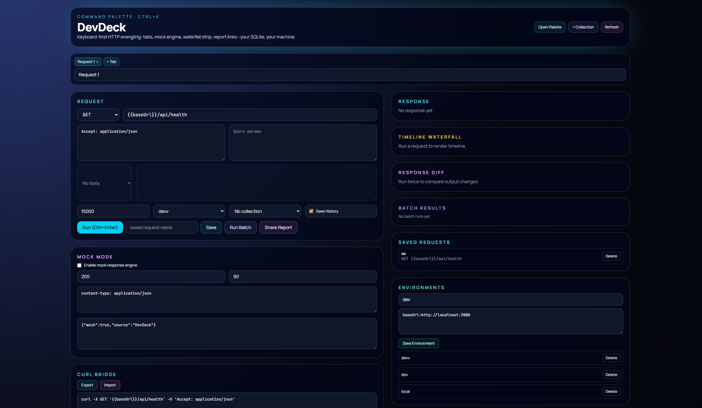

# devDeck - your API workbench

Self-hosted HTTP console: you own the SQLite file, the process, and the network calls. Palette-driven, tabbed, mockable-useful when the backend is late or you are tired of signing into someone else’s SaaS just to hit `GET`.



## Install

```bash
git clone https://github.com/supremebasics/devdeck.git
cd devdeck
npm install
npm run dev
```

**Docker:** `docker compose up --build` - app inside listens on `3000`, mapped to **`3060`** on the host.

## Configure

| Env | Default |
| --- | ------- |
| `DATABASE_PATH` | `./data/workbench.sqlite` |

Copy `.env.example` to `.env.local` only if you need a non-default path.

## What it does

- **Ctrl+K** / **Ctrl+Enter** — work from the keyboard  
- **Tabs** — several requests open without clobbering each other  
- **Mock engine** — fake status, delay, headers, body  
- **cURL** in and out  
- **OpenAPI** (JSON/YAML) → paste spec → fill the active tab from an operation  
- **Collections + batch** — run every saved call in a collection in one pass  
- **Waterfall + diff** — rough timing strip; line diff between last two bodies  
- **Report links** — `POST /api/reports` then `/reports/:id` for a frozen snapshot  

Stack: Next.js, TypeScript, `better-sqlite3`, Zod, `@apidevtools/swagger-parser`, Tailwind.

## HTTP surface (used by the UI)

These are **not** a public product API; they back the React app on the same origin.

| Route | Job |
| ----- | ----- |
| `POST /api/requests/execute` | Run one request |
| `GET /api/history?limit=80` | History |
| `GET` · `POST` · `DELETE` `/api/collections` | Collections |
| `GET` · `POST` `/api/requests/saved` | Saved requests |
| `DELETE /api/requests/saved/:id` | Delete saved |
| `GET` · `POST` `/api/environments` | Environments |
| `DELETE /api/environments/:id` | Delete env |
| `POST /api/openapi/import` | Parse OpenAPI |
| `POST /api/reports` | Store report |
| `GET /api/reports/:id` | Fetch report |

## Reports

UUID URLs are hard to guess, not magic-secure. Anyone with the link reads whatever you stored (bodies, headers, batch output). Fine on `localhost`; on a reachable host, treat it like a paste link and put access control in front if it matters.

## PRs

```bash
npm run lint
npm run build
```

See [CONTRIBUTING.md](CONTRIBUTING.md).

## License

[MIT](LICENSE)

---

`nextjs` `typescript` `sqlite` `self-hosted` `api-client` `openapi` `http-client` `developer-tools` `mocking` `docker`
